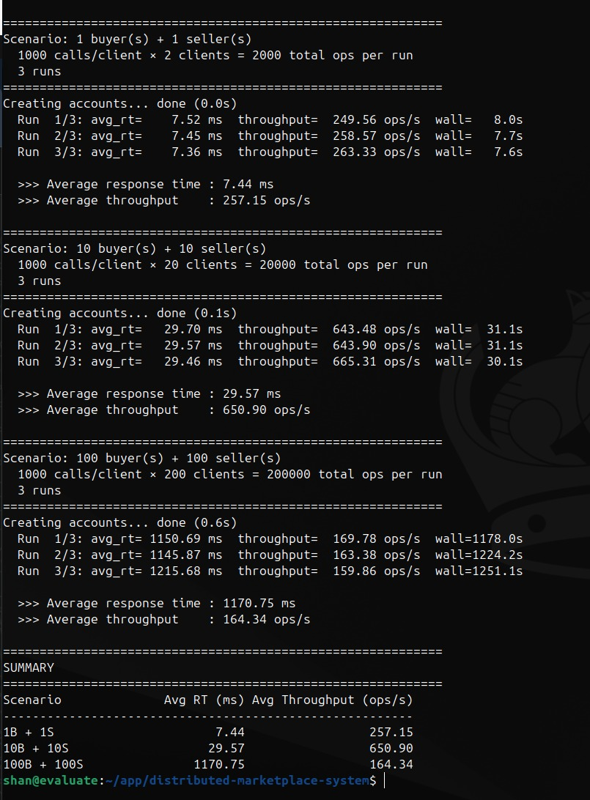

# Distributed Marketplace

A distributed online marketplace built as a multi-service system with separate buyer and seller clients, stateless frontend services, backend database services, and a financial transaction service.

This repository packages the project as a proper GitHub-ready codebase with architecture, deployment, usage, and performance documentation in one place.

## Overview

The system is composed of seven major components:

- Buyer CLI
- Seller CLI
- Buyer Frontend Server
- Seller Frontend Server
- Customer DB service
- Product DB service
- Financial Transaction Service

The design follows a distributed architecture where services run as independent processes, typically across separate VMs. The main communication paths are:

- **Client ↔ Frontend:** REST over HTTP using FastAPI and `requests`
- **Frontend ↔ Backend databases:** gRPC using Protocol Buffers
- **Frontend ↔ Financial service:** SOAP/WSDL using `spyne` and `zeep`
- **Persistence layer:** SQLite with WAL mode for concurrent access

Frontend services are stateless. Persistent marketplace data is stored in backend databases, and user session validation is handled through backend calls on each request.

## Architecture Highlights

- Stateless buyer and seller frontend services
- Separate customer and product database services
- Persistent storage with SQLite WAL mode
- SOAP-based payment service integration for checkout
- REST APIs for client-facing interactions
- gRPC contracts for internal service communication
- Concurrent request handling for multi-client workloads

## Features

### Seller Features

- Create account
- Login / logout
- Register an item for sale
- Change item price
- Update available inventory
- Display items for sale
- Get seller rating

### Buyer Features

- Create account
- Login / logout
- Search items
- Get item details
- Add item to cart
- Remove item from cart
- Get cart
- Clear cart
- Save cart
- Make purchase
- Get buyer purchase history
- Provide feedback
- Get seller rating

### Purchase Flow

`MakePurchase` validates credit card information, including:

- 16-digit card number
- 3-digit CVV
- Valid expiration date
- Cardholder name

The buyer frontend then calls the SOAP financial service. When approved, the system deducts inventory, stores purchase history, and clears the cart.

## Repository Structure

```text
.
├── backend/            # Database-backed service implementations
├── client/             # Buyer and seller CLI clients
├── common/             # Shared protocol, gRPC, REST, and TCP utilities
├── deploy/             # Startup scripts for distributed deployment
├── frontend/           # Buyer and seller frontend REST services
├── services/           # Supporting services such as financial transactions
├── evaluate.py         # Performance evaluation runner
├── PerformanceReport.md
├── README.md
└── requirements.txt
```

## Tech Stack

- Python
- FastAPI
- gRPC / Protocol Buffers
- SQLite
- SOAP/WSDL via `spyne` and `zeep`
- `requests`

## Setup

### Install dependencies

```bash
pip install -r requirements.txt
```

## Deployment

Automated startup scripts are available in the `deploy/` directory:

```bash
./deploy/start_customer_db.sh
./deploy/start_product_db.sh
./deploy/start_financial_service.sh
./deploy/start_seller_frontend.sh
./deploy/start_buyer_frontend.sh
```

For the intended deployment model, run services on separate VMs in roughly this order:

1. Start backend services
   - `Customer DB` on port `7001`
   - `Product DB` on port `7002`
2. Start frontend services
   - `Buyer Frontend` on port `7003`
   - `Seller Frontend` on port `7004`
3. Start the financial service
   - `Financial Transaction Service` on port `7005`
4. Start the clients

```bash
python -m client.seller_cli
python -m client.buyer_cli
```

See `deploy/README.md` for deployment script details.

## Local Notes

This project was designed for multi-VM deployment. If you want to run everything locally, update configured IP addresses to localhost or the appropriate local network addresses.

## Search Behavior

Item search filters by category and keyword matches. Results are ranked by:

1. Number of matching keywords
2. Feedback score (upvotes minus downvotes)
3. Lower price

Keyword handling rules:

- Normalized to lowercase
- Truncated to 8 characters
- Limited to 5 keywords per item

## Assumptions and Limitations

- The financial transaction service is a prototype and randomly approves about 90% of valid payment requests
- Sessions expire after 5 minutes of inactivity
- The system is optimized for distributed deployment rather than single-machine execution
- The financial service is expected to run on the buyer-side VM in the provided deployment model
- Database files are recreated on service restart for fresh testing
- The system begins to saturate at high concurrency levels, especially around the 100 buyer + 100 seller scenario

## Running the Evaluation

Use the benchmark script to run the performance scenarios:

```bash
python -m evaluate
```

The evaluation uses:

- 3 runs per scenario
- 1000 API calls per client per run
- Buyer workload: `GetCart`
- Seller workload: `DisplayItemsForSale`

## Performance Summary

### Experimental Setup

All seven components were executed as independent processes. Customer DB, Product DB, Seller Frontend, and Buyer Frontend were deployed on separate VMs. The financial transaction service ran on the buyer-side VM, which was allowed by the project requirements.

### Metrics

- **Average Response Time:** Time from sending a REST request to receiving the HTTP response
- **Average Throughput:** Completed operations divided by execution time
- **Wall Time:** Total time for the entire run

### Scenario Results

#### Scenario 1: 1 Buyer + 1 Seller

| Run | Response Time (ms) | Throughput (ops/s) | Wall Time (s) |
|-----|-------------------:|-------------------:|--------------:|
| 1 | 7.52 | 249.56 | 8.0 |
| 2 | 7.45 | 258.57 | 7.7 |
| 3 | 7.36 | 263.33 | 7.6 |

- **Average response time:** 7.44 ms
- **Average throughput:** 257.15 ops/s

Observation: With minimal concurrency, latency stays low and throughput remains stable. The system remains responsive under light load.

#### Scenario 2: 10 Buyers + 10 Sellers

| Run | Response Time (ms) | Throughput (ops/s) | Wall Time (s) |
|-----|-------------------:|-------------------:|--------------:|
| 1 | 29.70 | 643.48 | 31.1 |
| 2 | 29.57 | 643.90 | 31.1 |
| 3 | 29.46 | 665.31 | 30.1 |

- **Average response time:** 29.58 ms
- **Average throughput:** 650.90 ops/s

Observation: At moderate concurrency, throughput improves substantially because the frontend and gRPC services can process requests in parallel. Response time rises due to queueing and framework overhead under higher load.

#### Scenario 3: 100 Buyers + 100 Sellers

| Run | Response Time (ms) | Throughput (ops/s) | Wall Time (s) |
|-----|-------------------:|-------------------:|--------------:|
| 1 | 1150.69 | 169.78 | 1178.0 |
| 2 | 1145.87 | 163.38 | 1224.2 |
| 3 | 1215.68 | 159.86 | 1251.1 |

- **Average response time:** 1170.75 ms
- **Average throughput:** 164.34 ops/s

Observation: At high concurrency, the system becomes saturated. Large numbers of simultaneous HTTP and gRPC requests create major queueing delays, and throughput falls below the moderate-load scenario.

### Cross-Scenario Comparison

| Scenario | Clients | Avg Response Time (ms) | Avg Throughput (ops/s) |
|----------|---------|-----------------------:|-----------------------:|
| 1 | 1+1 | 7.44 | 257.15 |
| 2 | 10+10 | 29.58 | 650.90 |
| 3 | 100+100 | 1170.75 | 164.34 |

The system scales well from low to moderate concurrency, moving from underutilization to effective parallelism. At very high concurrency, contention dominates and performance degrades sharply.

## Key Findings

The evaluation results show the following for the current system:

1. **Strong performance at low concurrency**
   - With 1 buyer and 1 seller, the system maintains low latency and stable throughput.

2. **Best throughput at moderate concurrency**
   - With 10 buyers and 10 sellers, throughput increases significantly as the services make better use of concurrency.

3. **Saturation at high concurrency**
   - With 100 buyers and 100 sellers, latency rises sharply and throughput drops, indicating queueing delays and resource contention.

4. **Scalability is good up to moderate load**
   - The architecture handles small and medium workloads effectively, but performance degrades when the number of simultaneous clients becomes very large.

5. **Distributed-service overhead is visible under load**
   - The combination of REST, gRPC, SOAP, and persistent database access provides clean service boundaries, but also increases end-to-end request cost under heavy concurrency.

## Evaluation Figure



## Additional Documentation

- `deploy/README.md` for deployment script details
- `common/marketplace.proto` for gRPC service definitions
- `PerformanceReport.md` for the original standalone performance write-up
